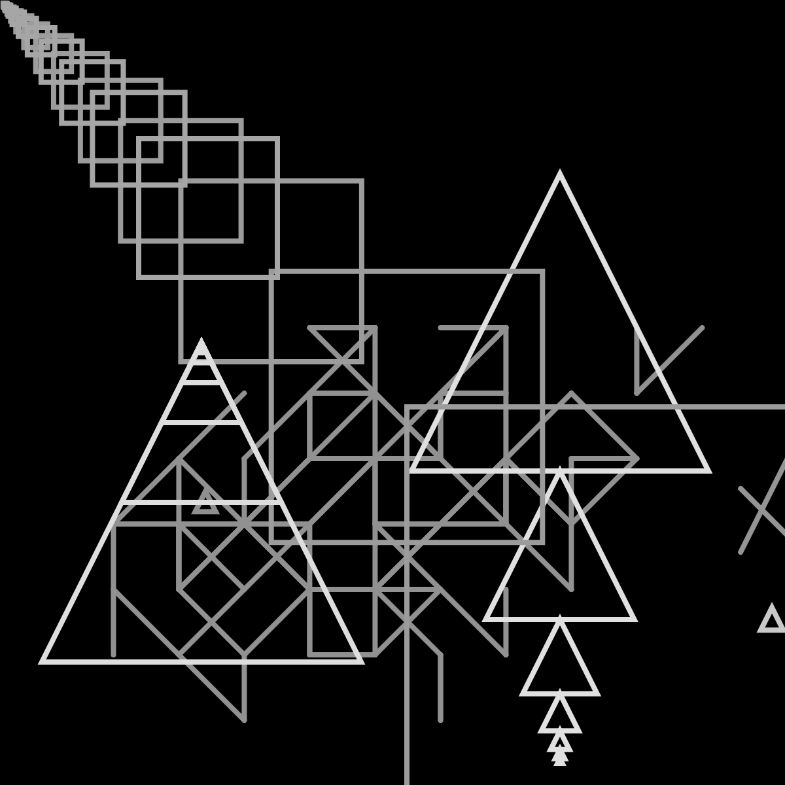
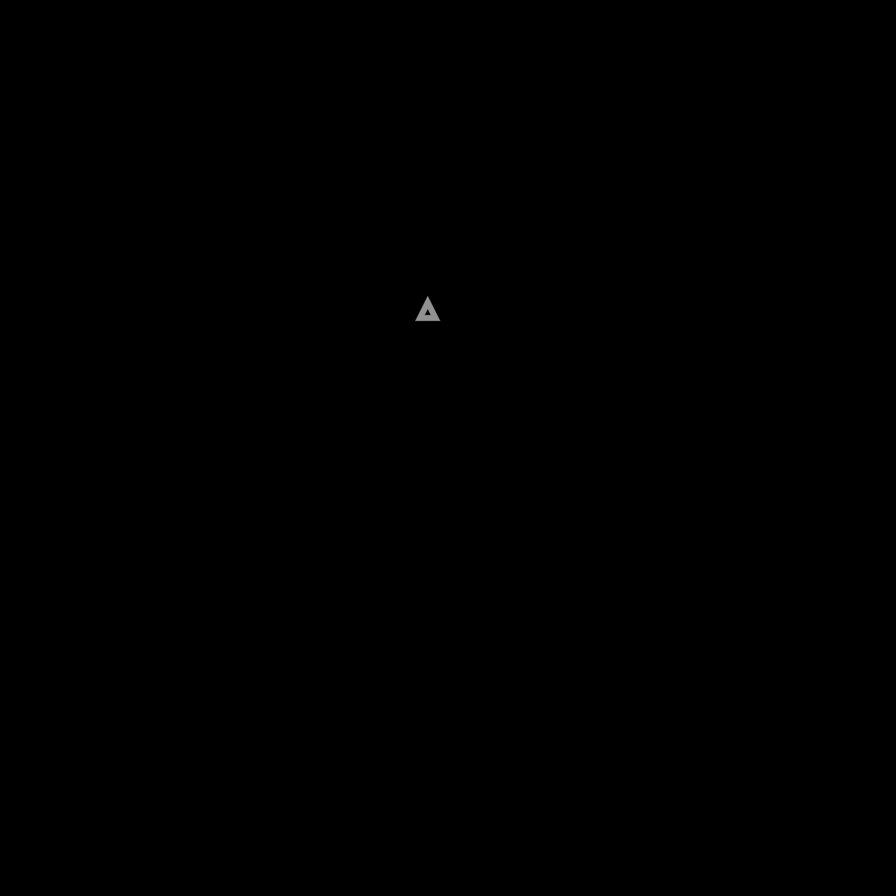
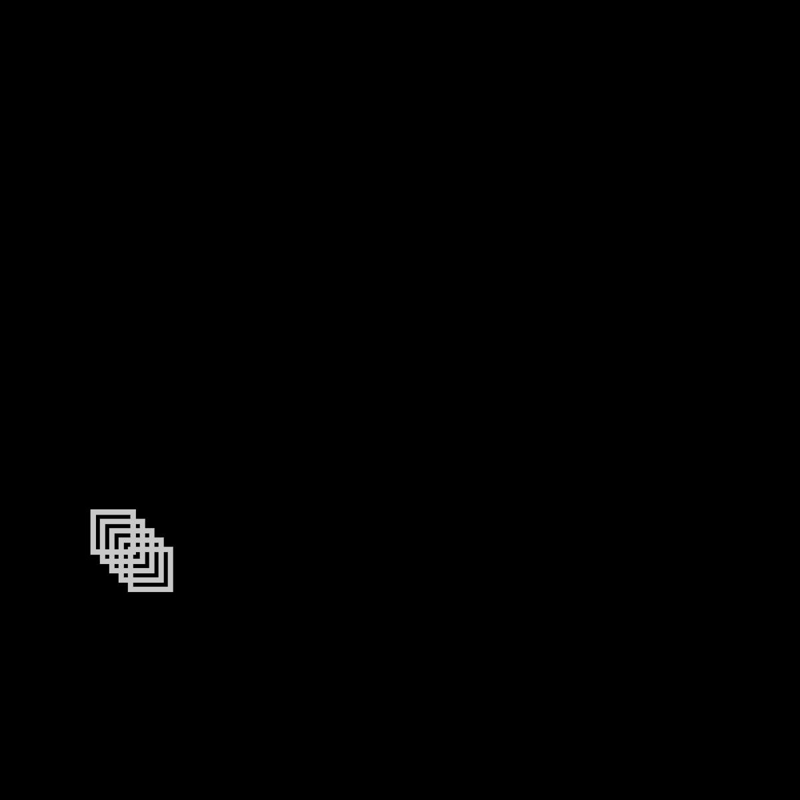
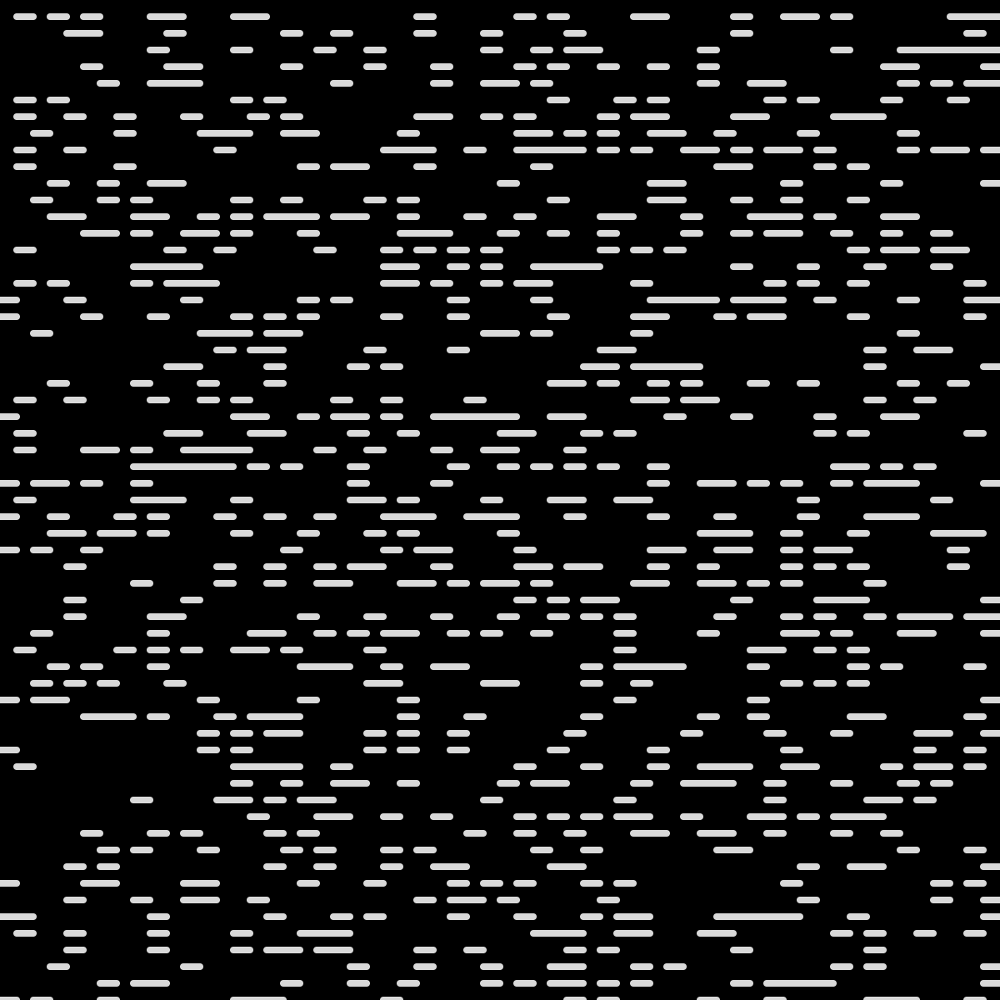
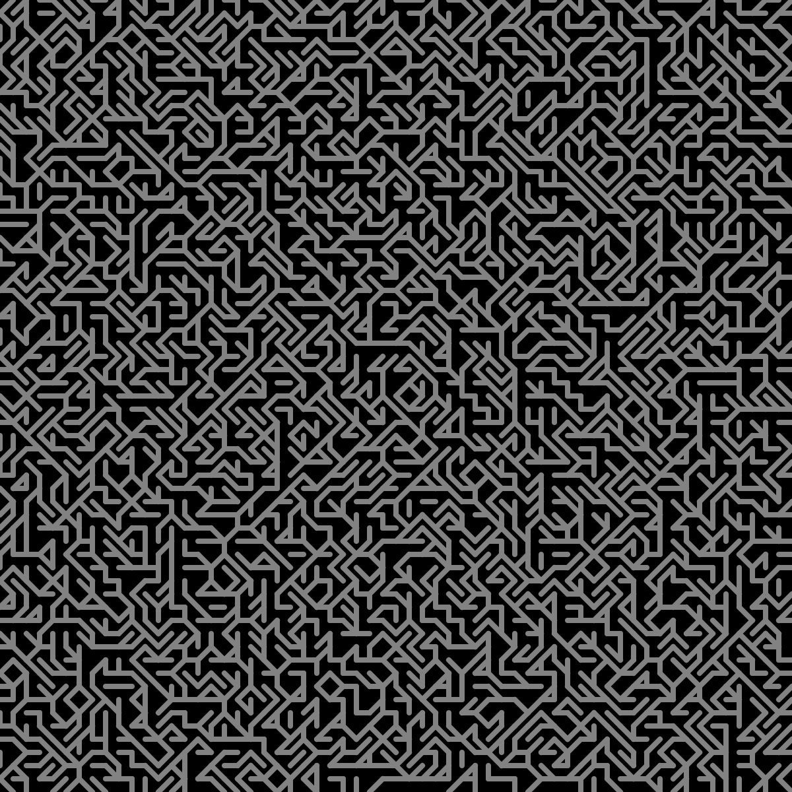

# Generative Art

A web application that allows users to generate art out of text.
<a href="https://jlizardo019.github.io/Generative-Art/">Try it out!</a>

## Summary
Generative Art is web application tool that allows users to generate art out of text. Each image that is produced is unique and irreproducible. To begin, users enter sentences or words on the text box on the right. As users type new letters, new shapes are drawn on the canvas. When the user is done typing, they have the option to clear the canvas or save the resulting image by clicking the appropriate buttons. Users can customize the colors of the background and the shapes that are drawn. The default background color is black and the default shape color is white.

## Process
The shapes and the canvas they are drawn on are created with p5.js using a series of techniques such as Perlin noise, recursion and fractals. There are 26 patterns, one for each letter in the English alphabet. The complexity of the pattern for each letter is loosely based on their <a href="" target="_blank">frequency</a> in the English language. Letters that appear frequently have small patterns, while letters that appear less frequently have large patterns that take up more of the canvas. Even if you enter the same letter twice, each pattern has various random variables at play. There are currently no patterns drawn for punctuation, space, or numbers.

Here are examples of the generated pattern for individual letters:

#### A 

#### E 

#### K 

#### Z 

## License
Please reach out if you would like to fork this project or contribute to development. Include attribution in any work that stems from this!

## Author

* [Julie Lizardo](https://www.linkedin.com/in/julie-lizardo/)  -- [Web Developer](https://julielizardo.com/)
